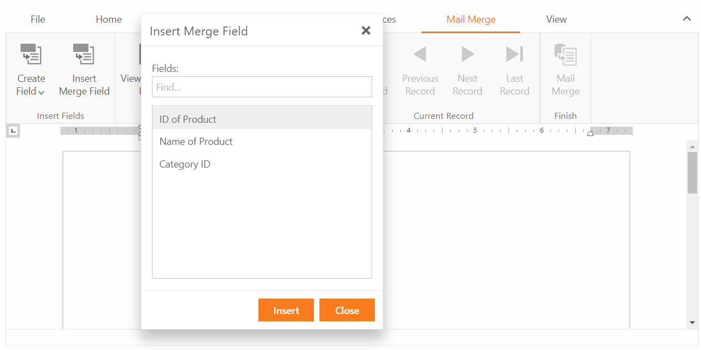

<!-- default badges list -->

<!-- default badges end -->

# How to handle the CustomizeMergeFields event
This example demonstrates how to handle ASPxRichEdit.CustomizeMergeFields event and add custom names for fields.

 ## Overview
MergeFieldNames object contains name of every field that is going to be displayed. Changing field.DisplayName property will change it apperance on the page.
## Files to Look At
[Default.aspx](./CS/RichEditCustomizeMergeFields/Default.aspx)
## Documentation
[ASPxRichEdit](https://docs.devexpress.com/AspNet/DevExpress.Web.ASPxRichEdit.ASPxRichEdit)

[ASPxRichEdit.CustomizeMergeFields](https://docs.devexpress.com/AspNet/DevExpress.Web.ASPxRichEdit.ASPxRichEdit.CustomizeMergeFields?p=netframework)
