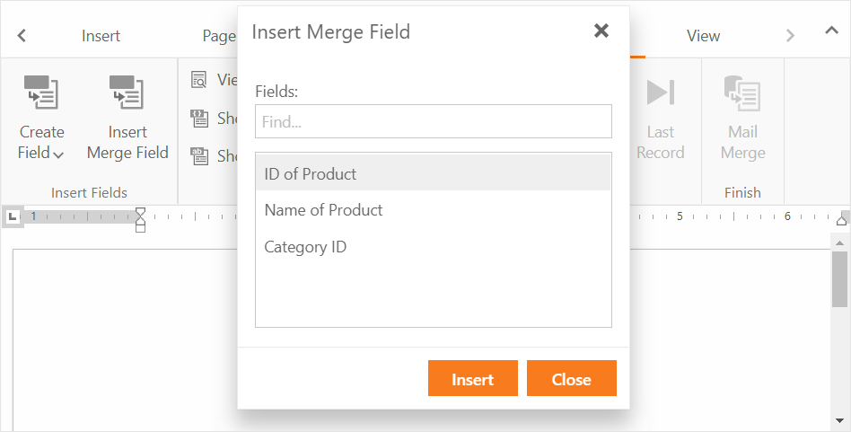

<!-- default badges list -->

<!-- default badges end -->

# Rich Text Editor for ASP.NET Web Forms - How to customize names of merge fields

This example demonstrates how to customize display names of merge fields in the Rich Text Editor.

## Overview

The [ASPxRichEdit](https://docs.devexpress.com/AspNet/DevExpress.Web.ASPxRichEdit.ASPxRichEdit)'s [CustomizeMergeFields](https://docs.devexpress.com/AspNet/DevExpress.Web.ASPxRichEdit.ASPxRichEdit.CustomizeMergeFields?) event fires when a user clicks the **Insert Merge Field** button in the **Mail Merge** tab. Handle this event to customize a drop-down field list.

The event arguments contain the [MergeFieldNames](https://docs.devexpress.com/OfficeFileAPI/DevExpress.XtraRichEdit.CustomizeMergeFieldsEventArgs.MergeFieldsNames) property that specifies a list of merge fields with their display names. Change a [MergeFieldName](https://docs.devexpress.com/OfficeFileAPI/DevExpress.XtraRichEdit.API.Native.MergeFieldName)'s [DisplayName](https://docs.devexpress.com/OfficeFileAPI/DevExpress.XtraRichEdit.API.Native.MergeFieldName.DisplayName) property to customize the display name of this field.

## Files to Look At

- [Default.aspx](./CS/handle-customizemergefields-event/Default.aspx)
- [Default.aspx.cs](./CS/handle-customizemergefields-event/Default.aspx.cs)

## Documentation

- [Mail Merge](https://docs.devexpress.com/AspNet/115133/components/rich-text-editor/mail-merge)

## More Examples

- [Rich Text Editor for ASP.NET Web Forms - How to change the mail merge data sources at runtime](https://github.com/DevExpress-Examples/aspxrichedit-how-to-change-the-mail-merge-data-sources-at-runtime-t542064)
- [Rich Text Editor for ASP.NET Web Forms - How to merge several documents content into a single document](https://github.com/DevExpress-Examples/aspxrichedit-how-to-merge-several-documents-content-into-a-single-document-t540811)
